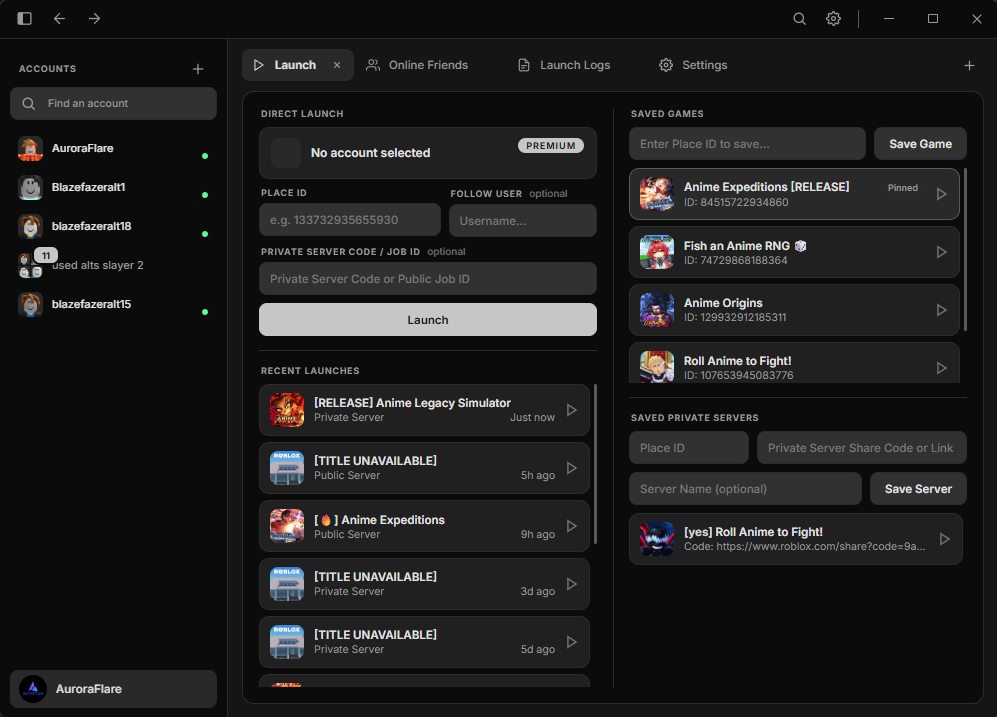

# BloxMulti

**The fast, clean multi-account launcher for Roblox.**

Manage every account in one place and launch them all into a game with a single click.

[Download](https://github.com/[your-username]/[repo]/releases) &nbsp;|&nbsp; [Website](https://noxith.com/bloxmulti/) &nbsp;|&nbsp; [More from Noxith](https://noxith.com)

---

<!-- Replace with a real screenshot URL -->

## Why BloxMulti?

Switching between Roblox accounts usually means logging out, logging in over and over. BloxMulti removes that friction: add your
accounts once, stay logged in to all of them, and jump into any game in seconds.

## Features

- **Multi-Account Support**: Add as many accounts as you need and switch between them instantly.
- **Isolated Sessions**: Each account gets its own browser session, so every account stays logged in at the same time.
- **Multi-Launch**: Select multiple accounts and launch them all into a game with one click.
- **Saved Games**: Store Place IDs and private server codes so you never have to copy-paste them again.
- **Pinning & Quick Actions**: Right-click accounts or games to pin, remove, or open a browser window for that account.
- **Modern UI**: A fast, clean interface that stays out of your way.

## Getting Started

### Requirements

- Windows [10/11]
- Microsoft WebView2 Runtime (included with most up-to-date Windows installs)

### Installation

1. Go to the [Releases](https://github.com/[your-username]/[repo]/releases) tab.
2. Download the latest `BloxMulti.exe`.
3. Run it. No installer needed.

### Usage

1. **Add accounts**: Click the **+** button in the sidebar and log in.
2. **Select accounts**: Click an account, or hold **Shift** to select several.
3. **Choose a game**: Enter a Place ID, or pick one from your saved games.
4. **Launch**: Click **Launch**.

> **Tip:** Right-click any account or game for extra options like pinning,
> removing, or opening a dedicated browser window.

## Privacy & Security

- Logins are handled through the official **Microsoft WebView2** runtime.
- All data is stored **locally on your computer**.
- Nothing is ever sent to external servers.

## FAQ

**Is BloxMulti free?**
[Add your answer.]

**Is it open source?**
No. BloxMulti is closed-source, but it uses the open-source libraries listed below.

**Where is my data stored?**
Locally on your own machine, and nowhere else.

**I found a bug or have a suggestion.**
Open an [issue](https://github.com/[your-username]/[repo]/issues) or reach out via
[noxith.com](https://noxith.com).

## Support & Community

| | |
|---|---|
| **Website** | [noxith.com/bloxmulti](https://noxith.com/bloxmulti/) |
| **More projects** | [noxith.com](https://noxith.com) |
| **Discord** | [your invite link] |
| **Bug reports** | [GitHub Issues](https://github.com/[your-username]/[repo]/issues) |

## Third-Party Licenses

BloxMulti is closed-source but uses these libraries:

| Library | Purpose | License |
|---|---|---|
| [nlohmann/json](https://github.com/nlohmann/json) | Data serialization | MIT |
| [Microsoft WebView2 SDK](https://developer.microsoft.com/microsoft-edge/webview2/) | Browser profiles | Microsoft SDK License |

Full license text is available in the app under **Settings > 3rd Party Licenses**.

## Disclaimer

BloxMulti is an independent project and is not affiliated with, endorsed by, or
sponsored by Roblox Corporation. "Roblox" is a trademark of Roblox Corporation.

---

Made by [Noxith](https://noxith.com) &nbsp;|&nbsp; [BloxMulti Website](https://noxith.com/bloxmulti/)

